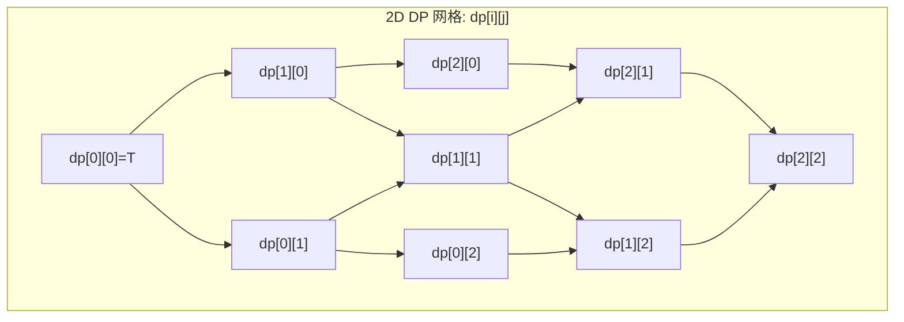
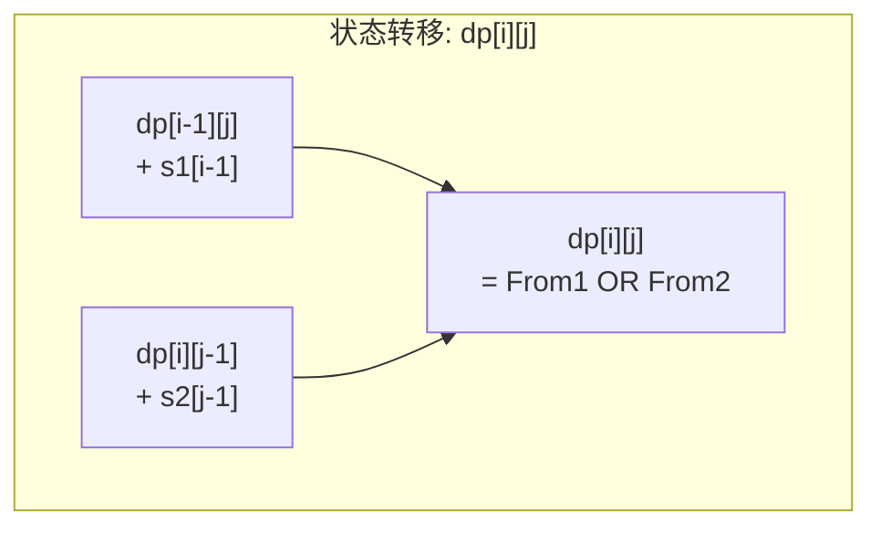
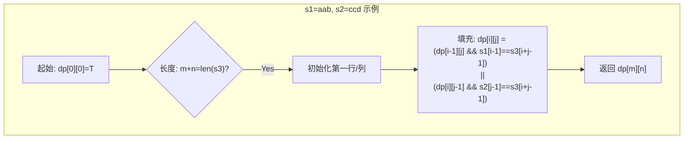

# LeetCode 97. Interleaving String（交错字符串） — **中等**

## 考点
String, Dynamic Programming

## 题目描述
给定三个字符串 `s1`、`s2`、`s3`，请你帮忙验证 `s3` 是否是由 `s1` 和 `s2` **交错** 组成的。

两个字符串 `s1` 和 `s2` 交错的定义：将 `s1` 和 `s2` 分别分割成若干子串，然后交替拼接这些子串形成的新字符串（保持各子串在原字符串中的相对顺序）。

### 示例 1
```
输入：s1 = "aabcc", s2 = "dbbca", s3 = "aadbbcbcac"
输出：true
```

### 示例 2
```
输入：s1 = "aabcc", s2 = "dbbca", s3 = "aadbbbaccc"
输出：false
```

### 示例 3
```
输入：s1 = "", s2 = "", s3 = ""
输出：true
```

### 约束
- `0 <= s1.length, s2.length <= 100`
- `0 <= s3.length <= 200`
- `s1`、`s2`、和 `s3` 都由小写英文字母组成

## 图解







## 解题思路

### 核心思路

交错字符串的判定：s3 是否可以通过交替从 s1 和 s2 中取字符构成，且不改变 s1、s2 内部字符的相对顺序。这等价于在 s3 的每个位置上，决定这一位是来自 s1 还是 s2，两种来源都要合法。使用二维 DP 来记录前 i 个 s1 字符和前 j 个 s2 字符能否组成 s3 的前 i+j 个字符。

### 方法一：二维动态规划

**算法步骤：**

1. 若 `len(s1) + len(s2) != len(s3)`，返回 false。
2. 初始化 `dp = [[False] * (n+1) for _ in range(m+1)]`，其中 m=len(s1), n=len(s2)。
3. `dp[0][0] = True`（两个空串可以组成空串）。
4. 填充第一列 `dp[i][0] = dp[i-1][0] and s1[i-1] == s3[i-1]`。
5. 填充第一行 `dp[0][j] = dp[0][j-1] and s2[j-1] == s3[j-1]`。
6. 填充内部：`dp[i][j] = (dp[i-1][j] and s1[i-1] == s3[i+j-1]) or (dp[i][j-1] and s2[j-1] == s3[i+j-1])`。
7. 返回 `dp[m][n]`。

**空间优化：** 使用一维 `dp` 数组（长度 n+1），每次从左到右更新。

**图解示例：**

```
s1 = "aab", s2 = "ccd", s3 = "aacabd"

m=3, n=3, |s3|=6, 长度匹配, 继续。

DP 表格 (行=i=使用s1前i个, 列=j=使用s2前j个):

      ""   "c"   "cc"  "ccd"
  ""   T    F     F     F
 "a"   T    F     F     F
 "aa"  T    F     F     F
 "aab" F    F     F     F

... 这个例子是 false。让我们用一个 true 的例子:

s1 = "aabcc", s2 = "dbbca", s3 = "aadbbcbcac"

DP 表格 (T=可组成):
      ""  d  db  dbb  dbbc  dbbca
  ""   T  F   F    F     F      F
 a     T  F   F    F     F      F
 aa    T  F   F    F     F      F
 aab   F  T   T    T     F      F
 aabc  F  F   T    T     T      F
 aabcc F  F   F    T     T      T  ← dp[5][5]=T

追溯: s3 = a a d b b c b c a c (长度10)
      s1 = a a b c c (从 s3 取: a a - b - c - c)
      s2 = d b b c a (从 s3 取: - - d b b c - a -)
```

**逐步追踪（以 `s1="ab", s2="bc", s3="abbc"` 为例）：**

```
m=2, n=2, s3长度=4 ✅

dp[0][0] = T

第一列:
  dp[1][0] = dp[0][0] && s1[0]=='a'==s3[0]=='a' = T
  dp[2][0] = dp[1][0] && s1[1]=='b'==s3[1]=='b' = T

第一行:
  dp[0][1] = dp[0][0] && s2[0]=='b'==s3[0]=='a' = F
  dp[0][2] = dp[0][1] && s2[1]=='c'==s3[1]=='b' = F

内部:
  dp[1][1] = (dp[0][1] && s1[0]==s3[1]?=F && 'a'=='b'?=F) || (dp[1][0] && s2[0]==s3[1]?=T && 'b'=='b'?=T) = T
  dp[1][2] = (dp[0][2] && s1[0]==s3[2]?=F) || (dp[1][1] && s2[1]==s3[2]?=T && 'c'=='b'?=F) = F
  dp[2][1] = (dp[1][1] && s1[1]==s3[2]?=T && 'b'=='b'?=T) || (dp[2][0] && s2[0]==s3[2]?=T && 'b'=='b'?=T) = T
  dp[2][2] = (dp[1][2] && s1[1]==s3[3]?=F) || (dp[2][1] && s2[1]==s3[3]?=T && 'c'=='c'?=T) = T

dp表:
     ""  b(bc) c
""    T   F     F
a(ab) T   T     F
ab    T   T     T  ← True
```

**边界情况：**

| 情况 | 处理方式 |
|------|---------|
| s1 或 s2 为空串 | 退化为一维匹配，DP 简化为另一串的字符逐一匹配 |
| s3 为空串 | 只有 s1 和 s2 都为空才 true |
| 长度不匹配 | 提前返回 false |
| s1, s2 相同字符 | 注意区分来源，DP 保证每种选择都有记录 |
| 大量重复字符 | DP 表格可能有很多 True，但不会出错 |

### 方法二：DFS + 记忆化搜索

定义一个递归函数 `dfs(i, j, k)` 表示用 `s1[i:]` 和 `s2[j:]` 能否构成 `s3[k:]`。用 `memo[i][j]` 记录中间结果，避免重复计算。

**复杂度分析：**

| 方法 | 时间复杂度 | 空间复杂度 |
|------|-----------|-----------|
| 二维 DP | O(m × n) | O(m × n) / O(n) 优化 |
| DFS + 记忆化 | O(m × n) | O(m × n) |
| 暴力递归 | O(2^(m+n)) | O(m+n) |

**关键点：**

- 不能改变 s1 和 s2 中字符的相对顺序——这就是「交错」的定义。
- DP 状态转移的两个来源分别代表「s3 当前位置的字符来自 s1」和「来自 s2」。
- 一维优化时需要从左到右遍历（每行重新计算），确保 `dp[j-1]` 使用的是当前行的值。
