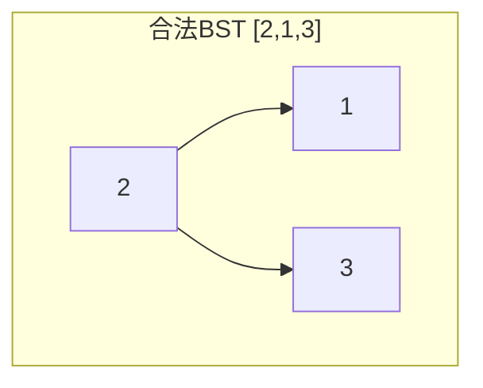
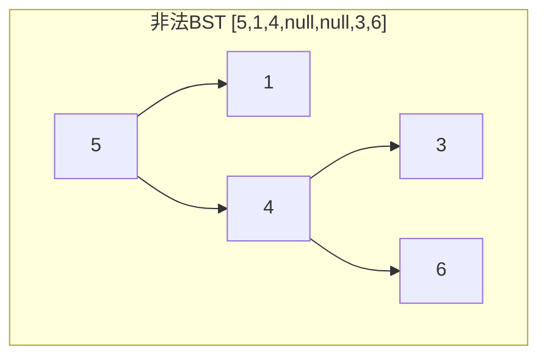
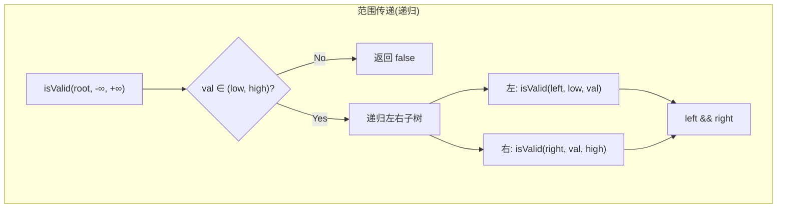

# LeetCode 98. Validate Binary Search Tree（验证二叉搜索树） — **中等**

## 考点
Tree, DFS, BST, Binary Tree

## 题目描述
给你一个二叉树的根节点 `root`，判断其是否是一个有效的二叉搜索树。

**有效** 二叉搜索树定义如下：
- 节点的左子树只包含 **小于** 当前节点的数。
- 节点的右子树只包含 **大于** 当前节点的数。
- 所有左子树和右子树自身必须也是二叉搜索树。

### 示例 1
```
输入：root = [2,1,3]
输出：true
```

### 示例 2
```
输入：root = [5,1,4,null,null,3,6]
输出：false
解释：根节点的值是 5，但是右子节点的值是 4。
```

### 约束
- 树中节点数目在范围 `[1, 10^4]` 内
- `-2^31 <= Node.val <= 2^31 - 1`

## 图解







## 解题思路

### 核心思路

BST 的核心约束不是「左子节点 < 根 < 右子节点」这么简单，而是**整个左子树的所有节点**都 < 根，**整个右子树的所有节点**都 > 根。因此需要维护一个不断缩小的合法范围 `(lower, upper)`，递归时传递这个约束。

### 方法一：递归 + 范围传递

**算法步骤：**

1. 定义 `isValid(node, lower, upper)`：
   - 若 `node == null`，返回 true（空树是合法的 BST）。
   - 若 `node.val <= lower or node.val >= upper`，返回 false。
   - 递归：`isValid(node.left, lower, node.val) && isValid(node.right, node.val, upper)`。
2. 调用 `isValid(root, -Infinity, +Infinity)`。

**图解示例：**

```
反例: 树 = [5,1,4,null,null,3,6]

      5
     / \
    1   4       ← 4 < 5? 是的 (局部成立)
       / \
      3   6     ← 3 在右子树, 但 3 < 5? 是的, 但不应该 < 5 (全局失败!)

范围传递过程:
  isValid(5, -∞, +∞):
    5 在(-∞,+∞) ✅
    isValid(1, -∞, 5):         ← 左子树, 上界收缩为 5
      1 在(-∞,5) ✅
      isValid(null, -∞, 1) ✅
      isValid(null, 1, 5)  ✅
      return true
    isValid(4, 5, +∞):         ← 右子树, 下界收缩为 5
      4 在(5,+∞)?  ❌ 4 <= 5!
      return false
  return false

正确例: 树 = [2,1,3]

      2
     / \
    1   3

范围传递:
  isValid(2, -∞, +∞)
    isValid(1, -∞, 2): 1 在(-∞,2) ✅, 左右子空 ✅ → true
    isValid(3, 2, +∞): 3 在(2,+∞) ✅, 左右子空 ✅ → true
  return true

更复杂的正确例: 树 = [10,5,15,null,null,6,20]

       10
      /  \
     5   15
         / \
        6  20

范围传递:
  isValid(10, -∞, +∞) ✅
    isValid(5, -∞, 10) ✅
    isValid(15, 10, +∞) ✅
      isValid(6, 10, 15) → 6 在(10,15)? ❌ 6 < 10!
      return false
  return false  ← 这就是「右子树的全部节点都要大于根」的意义
```

**逐步追踪（树 `[5,3,7,2,4,6,8]` — 合法的 BST）：**

```
        5
       / \
      3   7
     / \ / \
    2  4 6  8

isValid(5, -∞, +∞):
  5 in (-∞,+∞) ✅

  isValid(3, -∞, 5):
    3 in (-∞,5) ✅
    isValid(2, -∞, 3): 2 in (-∞,3) ✅ → true
    isValid(4, 3, 5): 4 in (3,5) ✅ → true
    return true

  isValid(7, 5, +∞):
    7 in (5,+∞) ✅
    isValid(6, 5, 7): 6 in (5,7) ✅ → true
    isValid(8, 7, +∞): 8 in (7,+∞) ✅ → true
    return true

return true  ← 合法的 BST
```

**边界情况：**

| 情况 | 处理方式 |
|------|---------|
| 空树 | 返回 true |
| 单节点 | 上下界检查通过，返回 true |
| 节点值等于边界 | 严格不等于，返回 false（BST 不能有重复值） |
| 节点值为 INT_MIN 或 INT_MAX | 用 long 或 None/null 表示无限大/小 |
| 左斜链（降序） | 每次递归上界收缩，能正确检测 |
| 右斜链（升序） | 每次递归下界收缩，能正确检测 |

### 方法二：中序遍历

**算法步骤：**

1. 对树进行中序遍历，将节点值存入数组。
2. 检查数组是否严格递增（每个元素 > 前一个）。
3. 优化：遍历时不存数组，只维护一个 `prev` 变量记录前一个访问的值，一旦发现 `cur <= prev` 就返回 false。

**复杂度分析：**

| 方法 | 时间复杂度 | 空间复杂度 |
|------|-----------|-----------|
| 递归范围传递 | O(n) | O(h) |
| 中序遍历 + 数组 | O(n) | O(n) |
| 中序遍历 + prev 变量 | O(n) | O(h) |
| BFS（不适用） | — | — |

**关键点：**

- BST 必须严格递增（不能有重复值），所以是 `<=` 比较。
- 范围传递法的初始边界如果是 `INT_MIN`/`INT_MAX`，当节点值等于这些极值时 `<=` 比较会出问题。用 `None` 或 long 可以避免。
- 这两道题的变种（验证 BST、有序数组转 BST、不同 BST 计数）考察了 BST 的完整定义理解。
