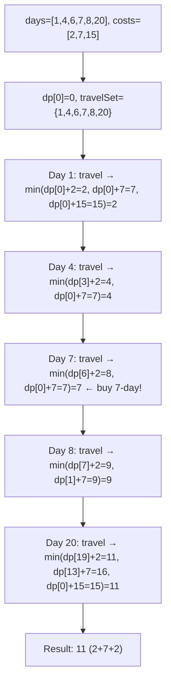
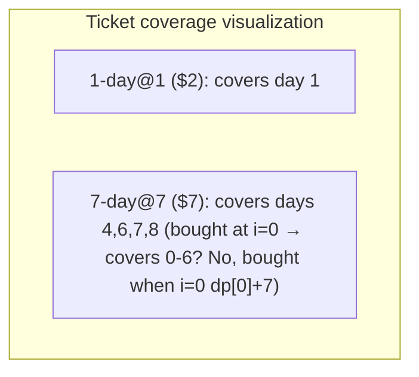
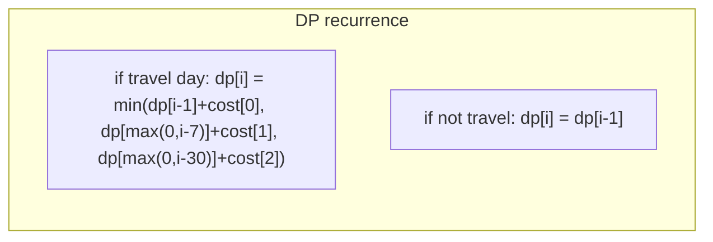

# LeetCode 983. Minimum Cost For Tickets（最低票价） — **中等**

## 考点
数组, 动态规划

## 题目描述
在一个火车旅行很受欢迎的国度，你提前一年计划了一些火车旅行。在接下来的一年里，你要旅行的日子将以一个名为 days 的数组给出。每一项是一个从 1 到 365 的整数。

火车票有三种不同的销售方式：
- 一张为期一天的通行证售价为 costs[0] 美元；
- 一张为期七天的通行证售价为 costs[1] 美元；
- 一张为期三十天的通行证售价为 costs[2] 美元。

通行证允许数天无限制的旅行。例如，如果我们在第 2 天获得一张为期 7 天的通行证，那么我们可以连着旅行 7 天：第 2 天、第 3 天、第 4 天、第 5 天、第 6 天、第 7 天和第 8 天。

返回你想要完成在给定的列表 days 中列出的每一天的旅行所需要的最低消费。

**示例 1:**
```
输入：days = [1,4,6,7,8,20], costs = [2,7,15]
输出：11
解释：
例如，这里有一种购买通行证的方法，可以让你完成你的旅行计划：
在第 1 天，你花了 costs[0] = $2 买了一张为期 1 天的通行证，它将在第 1 天生效。
在第 3 天，你花了 costs[1] = $7 买了一张为期 7 天的通行证，它将在第 3, 4, ..., 9 天生效。
在第 20 天，你花了 costs[0] = $2 买了一张为期 1 天的通行证，它将在第 20 天生效。
你总共花了 $11，并完成了你计划的每一天旅行。
```

**示例 2:**
```
输入：days = [1,2,3,4,5,6,7,8,9,10,30,31], costs = [2,7,15]
输出：17
解释：
例如，这里有一种方法可以满足你的计划：
在第 1 天，你花了 costs[2] = $15 买了一张为期 30 天的通行证，它将在第 1, 2, ..., 30 天生效。
在第 31 天，你花了 costs[0] = $2 买了一张为期 1 天的通行证，它将在第 31 天生效。
你总共花了 $17，并完成了你计划的每一天旅行。
```

**约束条件:**
- 1 <= days.length <= 365
- 1 <= days[i] <= 365
- days 按顺序严格递增
- costs.length == 3
- 1 <= costs[i] <= 1000

## 图解







## 解题思路

### 核心思路

**日期 DP**。一年固定 365 天，定义 `dp[i]` 为到第 i 天为止的最小花费。如果第 i 天不需要旅行，花费等于前一天；如果需要旅行，考虑三种购票策略的最小值。

### 算法步骤

1. 创建 `dp[366]`（或 `dp[lastDay+1]`），`dp[0] = 0`
2. 将旅行日存入 Set 便于快速检查
3. 遍历 i 从 1 到 lastDay（或 365）：
   - 若 i 不是旅行日：`dp[i] = dp[i-1]`
   - 若 i 是旅行日：
     - `dp[i] = dp[i-1] + costs[0]`（1 天票）
     - `dp[i] = min(dp[i], dp[max(0,i-7)] + costs[1])`（7 天票）
     - `dp[i] = min(dp[i], dp[max(0,i-30)] + costs[2])`（30 天票）
4. 返回 `dp[lastDay]`

**优化**：只需要计算到 lastDay（最后旅行日），而不是 365；只遍历旅行日，跳过非旅行日。

### 图解示例

```
days = [1, 4, 6, 7, 8, 20], costs = [2, 7, 15]

dp 数组:

i=0: dp[0]=0
i=1: 旅行日 → dp[1] = min(dp[0]+2=2, dp[0]+7=7, dp[0]+15=15) = 2
i=2: 非旅行日 → dp[2] = dp[1] = 2
i=3: 非旅行日 → dp[3] = dp[2] = 2
i=4: 旅行日 → dp[4] = min(dp[3]+2=4, dp[0]+7=7, dp[0]+15=15) = 4
i=5: 非旅行日 → dp[5] = dp[4] = 4
i=6: 旅行日 → dp[6] = min(dp[5]+2=6, dp[0]+7=7, dp[0]+15=15) = 6
i=7: 旅行日 → dp[7] = min(dp[6]+2=8, dp[0]+7=7, dp[0]+15=15) = 7
i=8: 旅行日 → dp[8] = min(dp[7]+2=9, dp[1]+7=9, dp[0]+15=15) = 9
...
i=20: 旅行日 → 
  dp[20] = min(dp[19]+2, dp[13]+7, dp[0]+15)
  前20天: ...需要追踪完整的dp值...

完整追踪:
  i=1: [2]     (买1天票)
  i=4: [4]      (买1天票, 因为2+2=4 < 7天票)
  但这里可能不是最优! 如果i=1买7天票覆盖1-7:
    dp[0]+7=7 → 覆盖1到7, dp[7]可能只需要7

更优方案:
  dp[0]=0
  i=1: 买7天票 → 覆盖[1-7], dp[7]候选=7
  i=6: 已被7天票覆盖, dp[6]=7
  i=7: dp[7]=min(dp[6], dp[0]+7)=7
  i=8: dp[8]=min(dp[7]+2=9, dp[1]+7=2+7=9, dp[0]+15=15)=9
  i=20: dp[20]=min(dp[19]+2, dp[13]+7, dp[0]+15)
         dp[19]=dp[18]=...=dp[8]=9
         dp[20]=min(9+2=11, 9+7=16?, 15)=11
         
最优: 2(i=1的1天票) + 7(i=3实际是i=1买的7天票?不)

重新想: 最优方案是第1天买2$的1天票(用第1天), 第3天买7$的7天票(覆盖3-9,即覆盖了4,6,7,8天)

  dp[0]=0
  第1天: dp[1]=min(dp[0]+2, dp[0]+7, dp[0]+15)=2
  第2,3天非travel: dp[2]=dp[3]=2
  第4天: dp[4]=min(dp[3]+2=4, dp[0]+7=7, dp[0]+15=15)=4
  但! 可以考虑在第0天买7天票 → dp[7]=7
  第1天: dp[1]=min(0+2=2, 0+7=7, 0+15=15)=2 (1天票仍然更优)
  第4天: dp[4]=min(dp[3]+2=4, dp[0]+7=7)=4
  第6天: dp[6]=min(dp[5]+2=6, dp[0]+7=7)=6
  第7天: dp[7]=min(dp[6]+2=8, dp[0]+7=7)=7  ← 买7天票!
  第8天: dp[8]=min(dp[7]+2=9, dp[1]+7=9)=9 (7天票覆盖到13)
  第20天: dp[20]=min(dp[19]+2=11, dp[13]+7=9+7=16, dp[0]+15=15)=11

等等, dp[13]需要用dp[8]推导, 但在第7天买的7天票覆盖到13:
  dp[9..13]=dp[8]=9
  dp[20]=min(dp[19]+2=9+2=11,...) 哦不对, dp[19]也等于dp[8]=9

所以 dp[20] = min(11, 16, 15) = 11

即: 1天票(1$) + 7天票(7$) + 1天票(1$) = 2+7+2 = 11 ✓
```

### 逐步追踪

| i | 旅行日? | dp[i-1]+costs[0] | dp[i-7]+costs[1] | dp[i-30]+costs[2] | dp[i] |
|---|--------|-----------------|-----------------|------------------|-------|
| 0 | - | - | - | - | 0 |
| 1 | Y | 0+2=2 | 0+7=7 | 0+15=15 | 2 |
| 2 | N | - | - | - | 2 |
| 3 | N | - | - | - | 2 |
| 4 | Y | 2+2=4 | 0+7=7 | 0+15=15 | 4 |
| 5 | N | - | - | - | 4 |
| 6 | Y | 4+2=6 | 0+7=7 | 0+15=15 | 6 |
| 7 | Y | 6+2=8 | 0+7=7 | 0+15=15 | 7 | ← 买7天票!
| 8 | Y | 7+2=9 | 2+7=9 | 0+15=15 | 9 |
| 9..13 | N | - | - | - | 9 |
| 20 | Y | 9+2=11 | 9+7=16 | 0+15=15 | 11 |

### 边界情况

- 只有 1 天旅行：`min(costs[0], costs[1], costs[2])`
- 所有天都旅行：按 30 天票可能更优
- 连续旅行天数多：月票优势大
- 稀疏旅行日：日票可能更优

### 复杂度分析

- **时间复杂度**：O(W)，W = max(days) ≤ 365
- **空间复杂度**：O(W)

### 方法对比

| 方法 | 时间复杂度 | 空间复杂度 | 说明 |
|------|-----------|-----------|------|
| DP 按天 | O(365) | O(365) | 简单直观 |
| DP 按旅行日 | O(n) | O(n) | 只算旅行日，更优 |
| DP 滚动窗口 | O(n) | O(30) | 空间优化到 30 |
| BFS/最短路 | O(n·3) | O(n) | 不太必要 |
