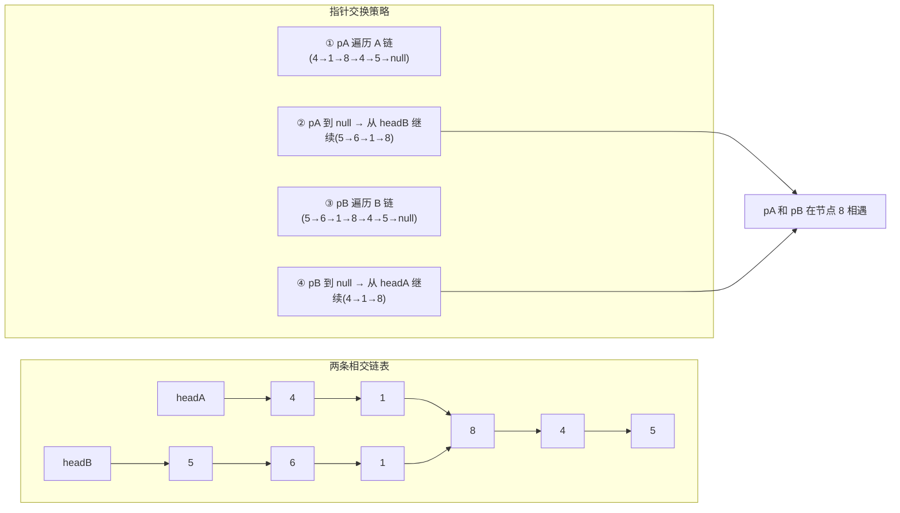

# LeetCode 160. Intersection of Two Linked Lists（相交链表）

## 考点
哈希表、链表、双指针

## 题目描述
给你两个单链表的头节点 `headA` 和 `headB`，请你找出并返回两个单链表相交的起始节点。如果两个链表不存在相交节点，返回 `null`。

图示两个链表在节点 `c1` 开始相交。

题目数据保证整个链式结构中不存在环。

注意，函数返回结果后，链表必须保持其原始结构。

**示例 1：**
```
输入：intersectVal = 8, listA = [4,1,8,4,5], listB = [5,6,1,8,4,5], skipA = 2, skipB = 3
输出：Intersected at '8'
```

**示例 2：**
```
输入：intersectVal = 0, listA = [2,6,4], listB = [1,5], skipA = 3, skipB = 2
输出：null
```

**提示：**
- listA 中节点数目为 m
- listB 中节点数目为 n
- `1 <= m, n <= 3 * 10^4`
- `1 <= Node.val <= 10^5`

## 图解



## 解题思路
**双指针法。**

**核心思想：** 让两个指针走相同的总路程。

设链表 A 的长度为 `a + c`，链表 B 的长度为 `b + c`，其中 `c` 是公共部分的长度。

让指针 `pA` 从 `headA` 出发，`pB` 从 `headB` 出发，每次各走一步：
- 当 `pA` 走到 A 的末尾时，让它从 `headB` 重新开始
- 当 `pB` 走到 B 的末尾时，让它从 `headA` 重新开始

这样两个指针走过的总路程都是 `a + b + c`，如果存在交点，它们会在交点相遇；如果不存在交点，它们会同时到达 `null`。

**算法：**
1. 初始化 `pA = headA`，`pB = headB`
2. 当 `pA !== pB` 时循环：
   - `pA = pA === null ? headB : pA.next`
   - `pB = pB === null ? headA : pB.next`
3. 返回 `pA`（要么是交点，要么是 `null`）

**关键点：**
- 即使两个链表不相交，最终两个指针都会变成 `null`，此时 `pA === pB` 退出循环
- 每个指针最多遍历 A + B 的长度

时间复杂度：O(m + n)  
空间复杂度：O(1)
