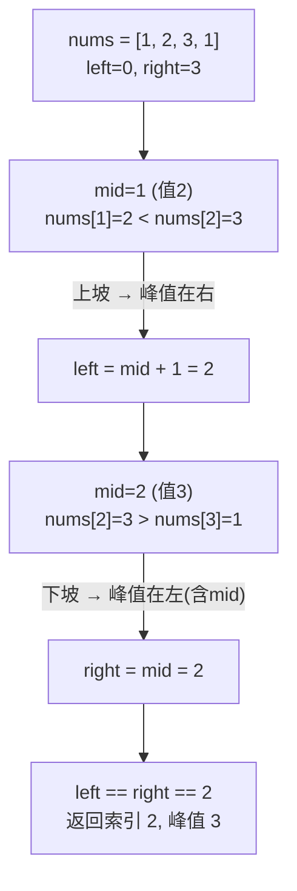

# LeetCode 162. Find Peak Element（寻找峰值）

## 考点
数组、二分查找

## 题目描述
峰值元素是指其值严格大于左右相邻值的元素。

给你一个整数数组 `nums`，找到峰值元素并返回其索引。数组可能包含多个峰值，在这种情况下，返回**任何一个峰值**所在位置即可。

你可以假设 `nums[-1] = nums[n] = -∞`。

你必须实现时间复杂度为 `O(log n)` 的算法来解决此问题。

**示例 1：**
```
输入：nums = [1,2,3,1]
输出：2
解释：3 是峰值元素，你的函数应该返回其索引 2。
```

**示例 2：**
```
输入：nums = [1,2,1,3,5,6,4]
输出：1 或 5
解释：你的函数可以返回索引 1（峰值元素为 2），或者返回索引 5（峰值元素为 6）。
```

**提示：**
- `1 <= nums.length <= 1000`
- `-2^31 <= nums[i] <= 2^31 - 1`
- 对于所有有效的 i 都有 `nums[i] != nums[i + 1]`

## 图解



## 解题思路
**二分查找。**

由于相邻元素不相等且边界之外为 -∞，可以利用「上坡必有峰」的性质进行二分。

**二分策略：** 比较 `nums[mid]` 和 `nums[mid + 1]`：
1. 如果 `nums[mid] > nums[mid + 1]`：说明当前处于下坡，峰值在左侧（包括 mid），`right = mid`
2. 如果 `nums[mid] < nums[mid + 1]`：说明当前处于上坡，峰值在右侧，`left = mid + 1`

**为什么可行？**
因为 `nums[-1] = -∞` 和 `nums[n] = -∞`，所以如果一直上坡，最终会到达 `n-1` 位置（它右边是 -∞，所以是峰值）。一直下坡则 `0` 位置是峰值。

**举例：**
- `[1,2,3,1]`：mid = 1 (值 2)，2 < 3，left = 2；mid = 2 (值 3)，3 > 1，right = 2，找到索引 2

时间复杂度：O(log n)  
空间复杂度：O(1)
