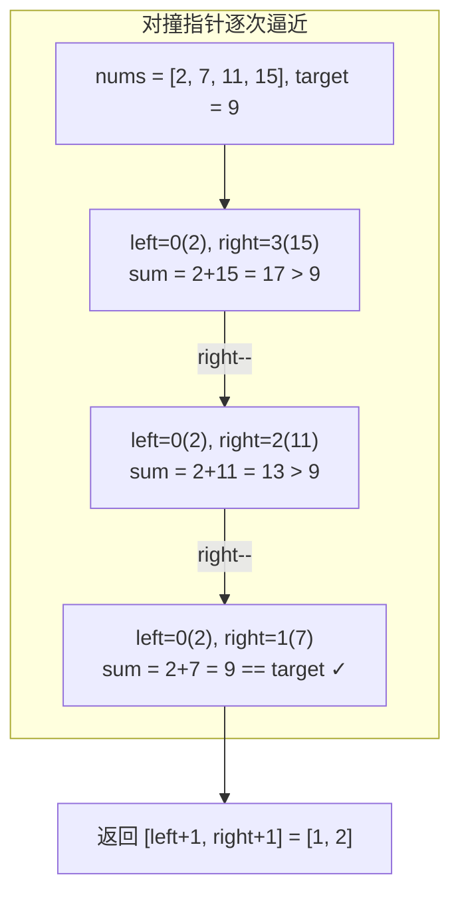

# LeetCode 167. Two Sum II - Input Array Is Sorted（两数之和 II - 输入有序数组）

## 考点
数组、双指针、二分查找

## 题目描述
给你一个下标从**1 开始**的整数数组 `numbers`，该数组已按**非递减顺序排列**，请你从数组中找出满足相加之和等于目标数 `target` 的两个数。

设这两个数分别是 `numbers[index1]` 和 `numbers[index2]`，则 `1 <= index1 < index2 <= numbers.length`。

以长度为 2 的整数数组 `[index1, index2]` 的形式返回这两个整数的下标 `index1` 和 `index2`。

你可以假设每个输入**只对应唯一的答案**，而且你**不可以**重复使用相同的元素。

你所设计的解决方案必须只使用常量级的额外空间。

**示例 1：**
```
输入：numbers = [2,7,11,15], target = 9
输出：[1,2]
解释：2 与 7 之和等于目标数 9。因此 index1 = 1, index2 = 2。返回 [1, 2]。
```

**示例 2：**
```
输入：numbers = [2,3,4], target = 6
输出：[1,3]
```

**示例 3：**
```
输入：numbers = [-1,0], target = -1
输出：[1,2]
```

**提示：**
- `2 <= numbers.length <= 3 * 10^4`
- `-1000 <= numbers[i] <= 1000`
- numbers 按**非递减顺序**排列
- `-1000 <= target <= 1000`
- 仅存在一个有效答案

## 图解



## 解题思路
**双指针法（对撞指针）。**

由于数组已排序，使用两个指针 `left` 和 `right` 分别指向数组首尾：

1. 计算 `sum = numbers[left] + numbers[right]`
2. 如果 `sum === target`：找到答案，返回 `[left + 1, right + 1]`（因为下标从 1 开始）
3. 如果 `sum < target`：需要更大的和，`left++`
4. 如果 `sum > target`：需要更小的和，`right--`

**为什么不需要考虑 `left` 回退？**
当 `sum < target` 时，`right` 已经是当前考虑的最大元素，任何小于 `right` 的元素加上 `numbers[left]` 只会更小，所以必须 `left++`。同理，`sum > target` 时也必须 `right--`。

**关键点：**
- 下标从 1 开始，返回时要 +1
- 数组有序是双指针解法成立的前提
- 也可以对每个元素使用二分查找，但双指针更优 O(n)

时间复杂度：O(n)  
空间复杂度：O(1)
