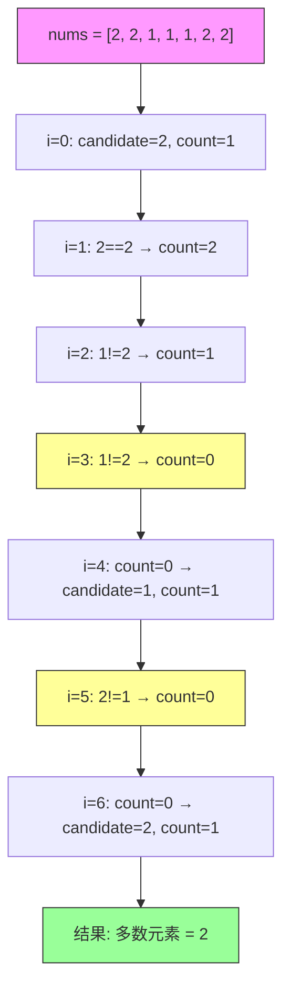

# LeetCode 169. Majority Element（多数元素）

## 考点
数组、哈希表、分治、计数、排序

## 题目描述
给定一个大小为 `n` 的数组 `nums`，返回其中的多数元素。多数元素是指在数组中出现次数**大于** `⌊n / 2⌋` 的元素。

你可以假设数组是非空的，并且给定的数组总是存在多数元素。

**示例 1：**
```
输入：nums = [3,2,3]
输出：3
```

**示例 2：**
```
输入：nums = [2,2,1,1,1,2,2]
输出：2
```

**提示：**
- `n == nums.length`
- `1 <= n <= 5 * 10^4`
- `-10^9 <= nums[i] <= 10^9`

**进阶：** 尝试设计时间复杂度为 O(n)、空间复杂度为 O(1) 的算法。

## 图解



## 解题思路
**Boyer-Moore 投票算法。**

**核心思想：** 多数元素的出现次数比其他所有元素的出现次数之和还要多，因此可以用互相抵消的思路。

**算法步骤：**
1. 初始化 `candidate = nums[0]`，`count = 1`
2. 从索引 1 开始遍历数组：
   - 如果 `count === 0`：将当前元素设为新的 `candidate`
   - 如果当前元素等于 `candidate`：`count++`
   - 如果当前元素不等于 `candidate`：`count--`
3. 遍历结束后，`candidate` 即为多数元素

**为什么正确？**
因为多数元素的数量 > n/2，在最坏情况下它也能抵消所有其他元素后至少剩余 1 票。

**举例：**
`[2,2,1,1,1,2,2]`
- i=0: candidate=2, count=1
- i=1: 2==2 → count=2
- i=2: 1!=2 → count=1
- i=3: 1!=2 → count=0
- i=4: count=0 → candidate=1, count=1
- i=5: 2!=1 → count=0
- i=6: count=0 → candidate=2, count=1
最终 cendidate=2

时间复杂度：O(n)  
空间复杂度：O(1)
