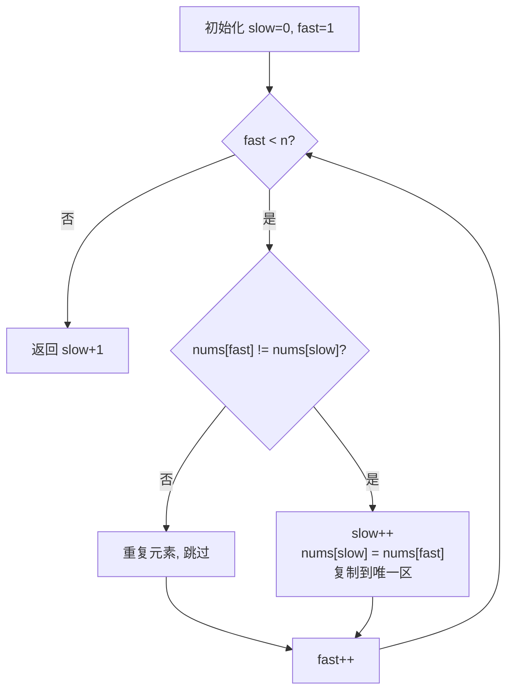

# LeetCode 26. Remove Duplicates from Sorted Array（删除有序数组中的重复项）

## 考点
Array, Two Pointers

## 题目描述
给你一个 **非严格递增排列** 的数组 `nums`，请你 **原地** 删除重复出现的元素，使每个元素 **只出现一次**，返回删除后数组的新长度。元素的 **相对顺序** 应该保持一致。然后返回 `nums` 中唯一元素的个数。

### 示例 1
```
输入：nums = [1,1,2]
输出：2, nums = [1,2,_]
```

### 示例 2
```
输入：nums = [0,0,1,1,1,2,2,3,3,4]
输出：5, nums = [0,1,2,3,4,_,_,_,_,_]
```

### 约束
- `1 <= nums.length <= 3 * 10^4`
- `-100 <= nums[i] <= 100`
- `nums` 已按非严格递增排列

## 图解



> **示例 [1,1,2]**: slow=0, fast=1(nums[1]=1) 相同跳过 → fast=2(nums[2]=2) 不同 → slow=1, nums[1]=2 → 返回 slow+1=2

## 解题思路

### 方法：双指针（快慢指针）
核心思想：慢指针 `slow` 指向已去重部分的末尾，快指针 `fast` 遍历数组。当发现不同元素时，将其复制到 `slow+1` 位置。

**步骤：**
1. 如果数组为空，返回 `0`。
2. `slow = 0`。
3. `fast` 从 `1` 遍历到 `n-1`：
   - 如果 `nums[fast] !== nums[slow]`，`slow++`，`nums[slow] = nums[fast]`。
4. 返回 `slow + 1`（唯一元素个数）。

**关键点：**
- `slow` 始终指向最后一个唯一元素的位置。
- 由于数组已排序，重复元素必定相邻，快指针跳过即可。
- 原地修改，前 `slow+1` 个位置就是无重复的有序数组。

时间复杂度：O(n)
空间复杂度：O(1)
