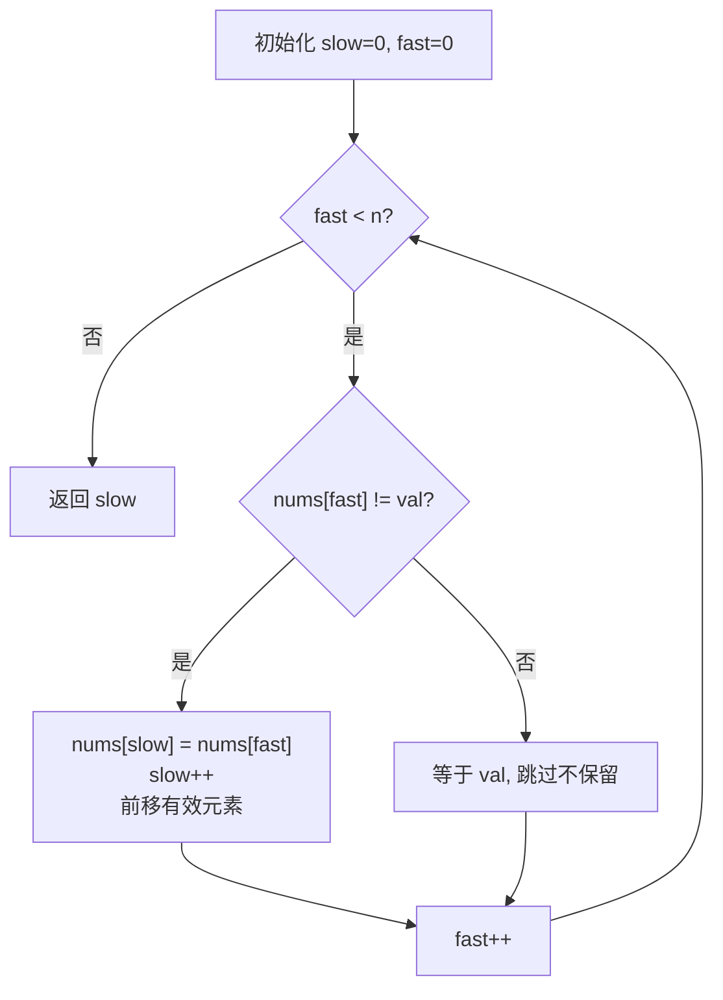

# LeetCode 27. Remove Element（移除元素）

## 考点
Array, Two Pointers

## 题目描述
给你一个数组 `nums` 和一个值 `val`，你需要 **原地** 移除所有数值等于 `val` 的元素。元素的顺序可以改变。然后返回 `nums` 中与 `val` 不同的元素的数量。

### 示例 1
```
输入：nums = [3,2,2,3], val = 3
输出：2, nums = [2,2,_,_]
```

### 约束
- `0 <= nums.length <= 100`
- `0 <= nums[i] <= 50`
- `0 <= val <= 100`

## 图解



> **示例 [3,2,2,3], val=3**: fast=0(nums=3) 跳过 → fast=1(nums=2) 复制到 slow=0, slow=1 → fast=2(nums=2) 复制到 slow=1, slow=2 → fast=3(nums=3) 跳过 → 返回 slow=2

## 解题思路

### 方法：双指针
核心思想：快指针遍历数组，慢指针记录下一个不等于 `val` 的元素应该放置的位置。

**步骤：**
1. `slow = 0`。
2. `fast` 遍历数组：
   - 如果 `nums[fast] !== val`，将 `nums[fast]` 复制到 `nums[slow]`，`slow++`。
   - 如果 `nums[fast] === val`，跳过。
3. 返回 `slow`。

**关键点：**
- 所有不等于 `val` 的元素被移动到数组前面。
- 等于 `val` 的元素被覆盖/忽略。
- 也可以从两端交换（与末尾元素交换），但上述方法保持相对顺序。

时间复杂度：O(n)
空间复杂度：O(1)
