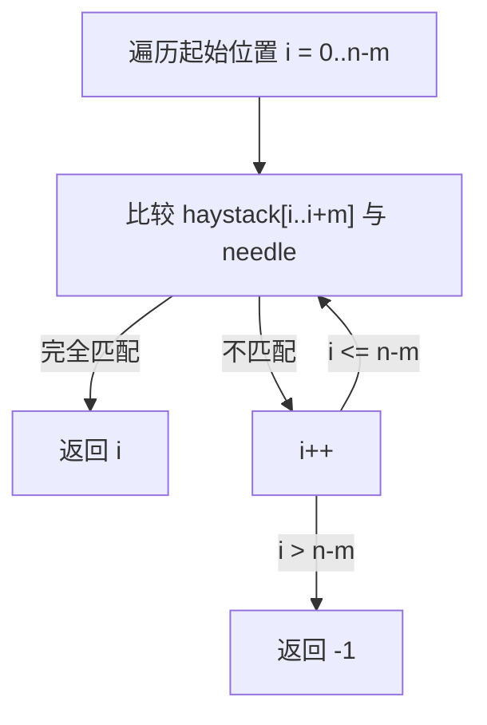

# LeetCode 28. Find the Index of the First Occurrence in a String（找出字符串中第一个匹配项的下标）

## 考点
Two Pointers, String, String Matching

## 题目描述
给你两个字符串 `haystack` 和 `needle`，请你在 `haystack` 字符串中找出 `needle` 字符串的第一个匹配项的下标（下标从 0 开始）。如果 `needle` 不是 `haystack` 的一部分，则返回 `-1`。

### 示例 1
```
输入：haystack = "sadbutsad", needle = "sad"
输出：0
```

### 示例 2
```
输入：haystack = "leetcode", needle = "leeto"
输出：-1
```

### 约束
- `1 <= haystack.length, needle.length <= 10^4`
- `haystack` 和 `needle` 仅由小写英文字符组成

## 图解



> **示例 haystack="hello", needle="ll"**: i=0 "he"≠"ll" → i=1 "el"≠"ll" → i=2 "ll"="ll" → 返回 2

## 解题思路

### 方法：暴力匹配
核心思想：在 `haystack` 的每个可能起始位置，逐一比较后续字符是否匹配 `needle`。

**步骤：**
1. `n = haystack.length`, `m = needle.length`。
2. 遍历起始位置 `i` 从 `0` 到 `n - m`：
   - 对于每个 `i`，检查 `haystack.substring(i, i + m) === needle`。
   - 如果匹配，返回 `i`。
3. 遍历结束未找到，返回 `-1`。

### 优化：KMP 算法
对于更高效的需求，可使用 KMP 算法在 O(n+m) 时间内解决。通过构建部分匹配表（next 数组），在匹配失败时避免回退，跳过已匹配的部分。

**关键点：**
- 暴力法在一般情况下足够（题目规模 ≤ 10^4）。
- KMP 算法是经典字符串匹配算法，面试中常问。

时间复杂度：O(n * m)（暴力），O(n + m)（KMP）
空间复杂度：O(1)（暴力），O(m)（KMP）
