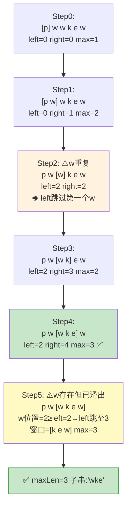

# LeetCode 3. Longest Substring Without Repeating Characters（无重复字符的最长子串）

## 考点
Hash Table, String, Sliding Window

## 题目描述
给定一个字符串 `s`，请你找出其中不含有重复字符的 **最长子串** 的长度。

### 示例 1
```
输入：s = "abcabcbb"
输出：3
解释：因为无重复字符的最长子串是 "abc"，所以其长度为 3。
```

### 示例 2
```
输入：s = "bbbbb"
输出：1
解释：因为无重复字符的最长子串是 "b"，所以其长度为 1。
```

### 示例 3
```
输入：s = "pwwkew"
输出：3
解释：因为无重复字符的最长子串是 "wke"，所以其长度为 3。
注意，答案必须是子串的长度，"pwke" 是一个子序列，不是子串。
```

### 约束
- `0 <= s.length <= 5 * 10^4`
- `s` 由英文字母、数字、符号和空格组成

## 滑动窗口指针移动图解

以 s = "pwwkew" 逐轮演示 left/right 指针跳转：



## 解题思路

### 方法：滑动窗口 + 哈希表
核心思想：维护一个滑动窗口 `[left, right]`，窗口内的字符不重复。使用哈希表记录每个字符最后出现的位置。

**步骤：**
1. 初始化 `left = 0`，`maxLen = 0`，哈希表 `map`（字符 → 最后出现位置）。
2. 遍历字符串，`right` 从 0 到 `n - 1`：
   - 如果 `s[right]` 在哈希表中且其位置 `>= left`，说明出现重复。
   - 将 `left` 移动到 `map.get(s[right]) + 1`（跳过重复字符）。
   - 更新 `map.set(s[right], right)`。
   - 更新 `maxLen = Math.max(maxLen, right - left + 1)`。
3. 返回 `maxLen`。

**关键点：**
- `left` 只会向右移动（不会回退）。
- 当发现重复字符时，需要确保跳过的位置在窗口内（`>= left`）。
- 每个字符最多被访问两次（右指针一次，左指针移动一次）。

时间复杂度：O(n)
空间复杂度：O(min(m, n))，其中 m 是字符集大小
