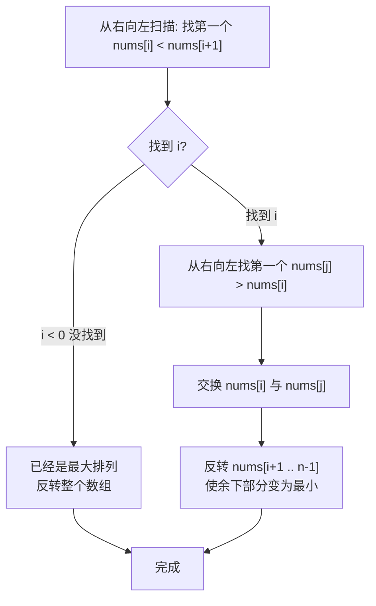

# LeetCode 31. Next Permutation（下一个排列）

## 考点
Array, Two Pointers

## 题目描述
整数数组的一个 **排列** 就是将其所有成员以序列或线性顺序排列。

整数数组的 **下一个排列** 是指其整数的下一个字典序更大的排列。如果不存在下一个更大的排列，那么这个数组必须重排为字典序最小的排列（即升序排列）。

必须 **原地** 修改，只允许使用额外常数空间。

### 示例 1
```
输入：nums = [1,2,3]
输出：[1,3,2]
```

### 示例 2
```
输入：nums = [3,2,1]
输出：[1,2,3]
```

### 约束
- `1 <= nums.length <= 100`
- `0 <= nums[i] <= 100`

## 图解



> **示例 [1,2,3]**: 找到 i=1 (2<3) → j=2 (3>2) → 交换 → [1,3,2] → 反转[2]不变 → [1,3,2]

## 解题思路

### 方法：两次扫描
核心思想：从右向左找到第一个非递减的断点，然后找到比它大的最小元素交换，最后反转断点右侧的子数组。

**步骤：**
1. 从右向左找到第一个 `nums[i] < nums[i+1]` 的位置 `i`。
2. 如果 `i >= 0`：
   - 从右向左找到第一个 `nums[j] > nums[i]` 的位置 `j`。
   - 交换 `nums[i]` 和 `nums[j]`。
3. 反转 `nums[i+1]` 到末尾的子数组。
4. 如果步骤 1 找不到 `i`（即 `i < 0`），说明当前排列是最大排列，直接反转整个数组。

**关键点：**
- 这是经典算法，步骤固定。
- 找到断点后，断点右侧是降序的（已经是最大排列），需要将其变为最小排列（升序）。
- 交换操作保证新排列刚好比原排列大。

时间复杂度：O(n)
空间复杂度：O(1)
