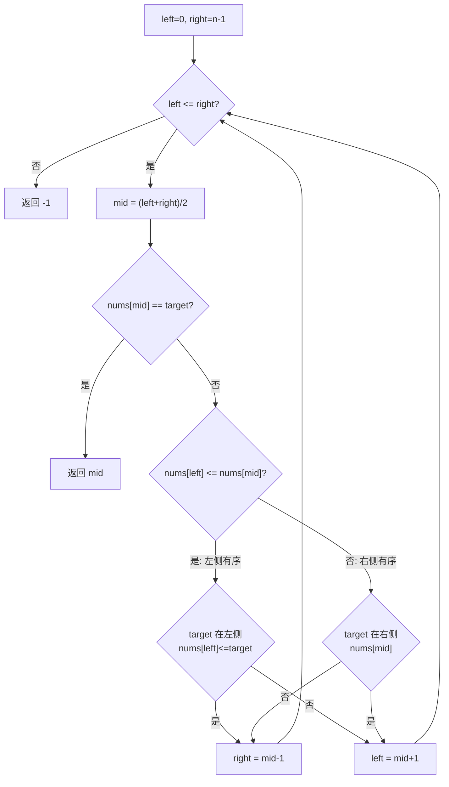

# LeetCode 33. Search in Rotated Sorted Array（搜索旋转排序数组）

## 考点
Array, Binary Search

## 题目描述
整数数组 `nums` 按升序排列，数组中的值 **互不相同**。

在传递给函数之前，`nums` 在预先未知的某个下标 `k`（`0 <= k < nums.length`）上进行了 **旋转**，使数组变为 `[nums[k], nums[k+1], ..., nums[n-1], nums[0], nums[1], ..., nums[k-1]]`。

给你 **旋转后** 的数组 `nums` 和一个整数 `target`，如果 `nums` 中存在这个目标值 `target`，则返回它的下标，否则返回 `-1`。

必须设计一个时间复杂度为 O(log n) 的算法解决此问题。

### 示例 1
```
输入：nums = [4,5,6,7,0,1,2], target = 0
输出：4
```

### 约束
- `1 <= nums.length <= 5000`
- `-10^4 <= nums[i] <= 10^4`
- `nums` 中每个值独一无二
- `nums` 原来是一个升序排列的数组

## 图解



> **示例 [4,5,6,7,0,1,2], target=0**: mid=3(nums=7), 左侧[4..7]有序, 0不在左侧 → left=4 → mid=5(nums=1), 右侧[0..2]有序, 0在右侧 → right=4 → mid=4(nums=0) → 返回4

## 解题思路

### 方法：二分查找
核心思想：二分查找时，通过比较 `nums[mid]` 和 `nums[right]`（或 `nums[left]`）判断哪一侧是有序的，然后在有序侧判断 target 是否在范围内。

**步骤：**
1. 初始化 `left = 0`, `right = n - 1`。
2. 当 `left <= right`：
   - `mid = (left + right) >> 1`。
   - 如果 `nums[mid] === target`，返回 `mid`。
   - 判断哪一侧有序：
     - 如果 `nums[left] <= nums[mid]`（左侧有序）：
       - 如果 `nums[left] <= target < nums[mid]`：在左侧搜索，`right = mid - 1`。
       - 否则：在右侧搜索，`left = mid + 1`。
     - 否则（右侧有序）：
       - 如果 `nums[mid] < target <= nums[right]`：在右侧搜索，`left = mid + 1`。
       - 否则：在左侧搜索，`right = mid - 1`。
3. 返回 `-1`。

**关键点：**
- 关键是判断 target 落在有序的一侧还是无序的一侧。
- `nums[mid]` 一定会把数组分成一个有序部分和一个可能无序部分。
- 所有元素互不相同，判断条件不会出错。

时间复杂度：O(log n)
空间复杂度：O(1)
