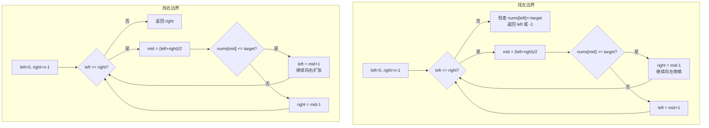

# LeetCode 34. Find First and Last Position of Element in Sorted Array（在排序数组中查找元素的第一个和最后一个位置）

## 考点
Array, Binary Search

## 题目描述
给你一个按照非递减顺序排列的整数数组 `nums`，和一个目标值 `target`。请你找出给定目标值在数组中的开始位置和结束位置。

如果数组中不存在目标值 `target`，返回 `[-1, -1]`。

你必须设计并实现时间复杂度为 O(log n) 的算法。

### 示例 1
```
输入：nums = [5,7,7,8,8,10], target = 8
输出：[3,4]
```

### 示例 2
```
输入：nums = [5,7,7,8,8,10], target = 6
输出：[-1,-1]
```

### 约束
- `0 <= nums.length <= 10^5`
- `-10^9 <= nums[i] <= 10^9`
- `nums` 是一个非递减数组

## 图解



> **示例 [5,7,7,8,8,10], target=8**: 左边界: mid≥8 收缩右边界, 最终 left=3 → 右边界: mid≤8 收缩左边界, 最终 right=4 → [3,4]

## 解题思路

### 方法：两次二分查找
核心思想：分别二分查找目标值的第一个位置和最后一个位置。找第一个位置时，即使找到 target 也继续向左搜索；找最后一个位置时，即使找到 target 也继续向右搜索。

**找左边界步骤：**
1. `left = 0, right = n - 1`。
2. 当 `left <= right`：
   - `mid = (left + right) >> 1`。
   - 如果 `nums[mid] >= target`：`right = mid - 1`（继续向左）。
   - 否则：`left = mid + 1`。
3. 检查 `left < n && nums[left] === target`，否则返回 `-1`。

**找右边界步骤：**
1. `left = 0, right = n - 1`。
2. 当 `left <= right`：
   - `mid = (left + right) >> 1`。
   - 如果 `nums[mid] <= target`：`left = mid + 1`（继续向右）。
   - 否则：`right = mid - 1`。
3. 返回 `right`。

**关键点：**
- 左边界用 `>=` 收缩右边界，右边界用 `<=` 收缩左边界。
- 两种二分的关键区别在于相等时的处理。

时间复杂度：O(log n)
空间复杂度：O(1)
