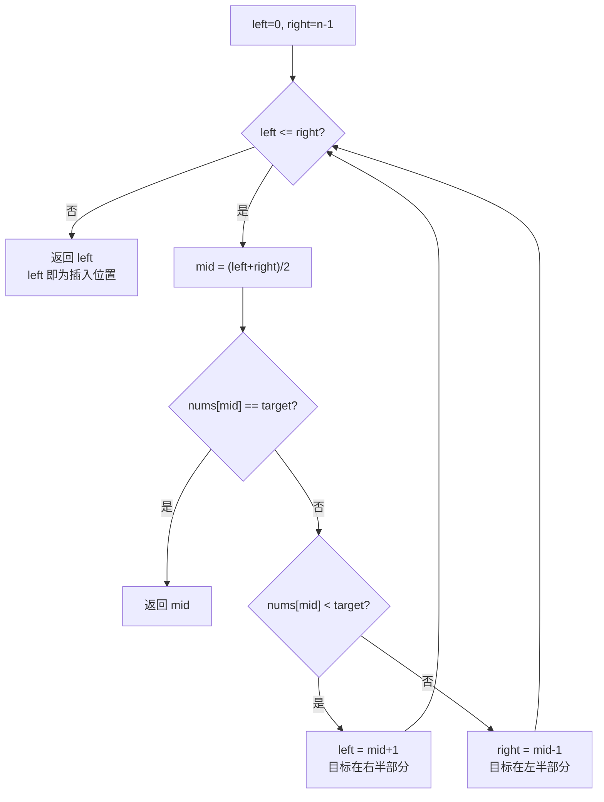

# LeetCode 35. Search Insert Position（搜索插入位置）

## 考点
Array, Binary Search

## 题目描述
给定一个排序数组和一个目标值，在数组中找到目标值，并返回其索引。如果目标值不存在于数组中，返回它将会被按顺序插入的位置。

请必须使用时间复杂度为 O(log n) 的算法。

### 示例 1
```
输入: nums = [1,3,5,6], target = 5
输出: 2
```

### 示例 2
```
输入: nums = [1,3,5,6], target = 2
输出: 1
```

### 约束
- `1 <= nums.length <= 10^4`
- `-10^4 <= nums[i] <= 10^4`
- `nums` 为无重复元素的升序排列数组
- `-10^4 <= target <= 10^4`

## 图解



> **示例 [1,3,5,6], target=2**: mid=1(nums=3)>2 → right=0 → mid=0(nums=1)<2 → left=1 → loop结束 → 返回 left=1

## 解题思路

### 方法：二分查找
核心思想：标准二分查找。如果找到 target 返回其索引；否则，二分查找结束时 `left` 就是应该插入的位置。

**步骤：**
1. `left = 0`, `right = n - 1`。
2. 当 `left <= right`：
   - `mid = (left + right) >> 1`。
   - 如果 `nums[mid] === target`，返回 `mid`。
   - 如果 `nums[mid] < target`：`left = mid + 1`。
   - 否则：`right = mid - 1`。
3. 返回 `left`（即第一个大于 target 的位置）。

**关键点：**
- 标准二分查找，未找到时 `left` 就是插入位置。
- `right` 最终会停在 `left - 1`，即最后一个小于 target 的位置。
- 当 `target` 比所有元素都大时，`left = n`。

时间复杂度：O(log n)
空间复杂度：O(1)
