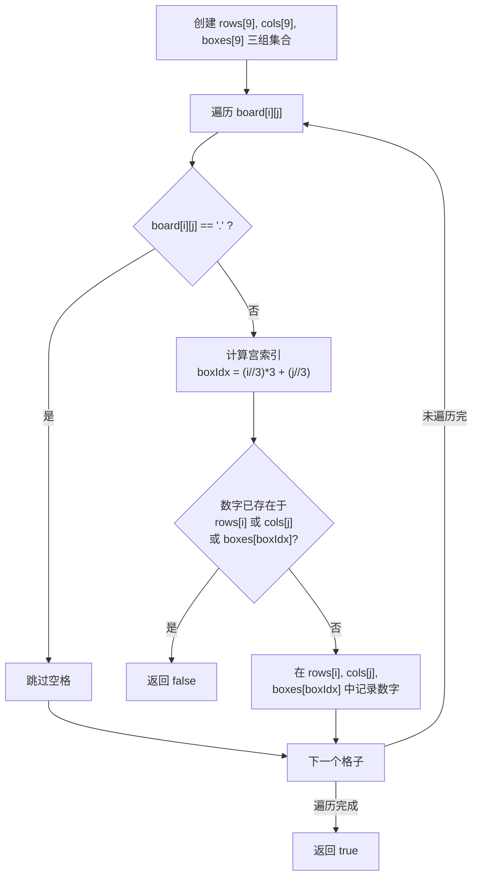

# LeetCode 36. Valid Sudoku（有效的数独）

## 考点
Array, Hash Table, Matrix

## 题目描述
请你判断一个 `9 x 9` 的数独是否有效。只需要根据以下规则，验证已经填入的数字是否有效即可。

1. 数字 `1-9` 在每一行只能出现一次。
2. 数字 `1-9` 在每一列只能出现一次。
3. 数字 `1-9` 在每一个以粗实线分隔的 `3x3` 宫内只能出现一次。

注意：
- 一个有效的数独（部分已被填充）不一定是可解的。
- 只需要根据以上规则，验证已经填入的数字是否有效即可。
- 空白格用 `'.'` 表示。

### 示例
```
输入：board =
[["5","3",".",".","7",".",".",".","."]
,["6",".",".","1","9","5",".",".","."]
,[".","9","8",".",".",".",".","6","."]
,["8",".",".",".","6",".",".",".","3"]
,["4",".",".","8",".","3",".",".","1"]
,["7",".",".",".","2",".",".",".","6"]
,[".","6",".",".",".",".","2","8","."]
,[".",".",".","4","1","9",".",".","5"]
,[".",".",".",".","8",".",".","7","9"]]
输出：true
```

## 图解



> **三组约束**: 每个数字必须同时满足行、列、3x3宫的唯一性。宫索引公式将 (i,j) 映射到 0-8 的宫编号。

## 解题思路

### 方法：哈希表（数组模拟）
核心思想：用 3 组哈希结构分别记录每行、每列、每个 3x3 宫出现过的数字。

**步骤：**
1. 创建 9 个行集合、9 个列集合、9 个宫集合（使用二维布尔数组或 Set）。
2. 遍历每个格子 `board[i][j]`：
   - 如果是 `'.'`，跳过。
   - 计算宫索引：`boxIndex = Math.floor(i / 3) * 3 + Math.floor(j / 3)`。
   - 检查行 `i`、列 `j`、宫 `boxIndex` 是否已包含该数字：
     - 如果已包含，返回 `false`。
     - 否则，在对应集合中标记该数字。
3. 遍历结束返回 `true`。

**关键点：**
- 宫索引计算：`(i / 3) * 3 + (j / 3)`，前 3 列宫索引 0,1,2，中间 3 列 3,4,5，后 3 列 6,7,8。
- 使用二维布尔数组比 Set 更高效（值域有限）。

时间复杂度：O(1)（固定 81 个格子）
空间复杂度：O(1)（固定大小）
