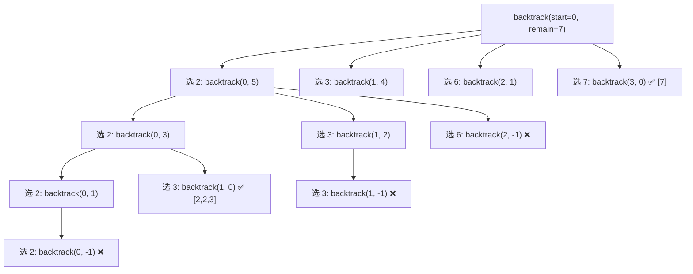

# LeetCode 39. Combination Sum（组合总和）

## 考点
Array, Backtracking

## 题目描述
给你一个 **无重复元素** 的整数数组 `candidates` 和一个目标整数 `target`，找出 `candidates` 中可以使数字和为目标数 `target` 的 **所有不同组合**，并以列表形式返回。你可以按 **任意顺序** 返回这些组合。

`candidates` 中的 **同一个数字** 可以 **无限制重复被选取**。如果至少一个所选数字数量不同，则两种组合是不同的。

### 示例 1
```
输入：candidates = [2,3,6,7], target = 7
输出：[[2,2,3],[7]]
解释：2 和 3 可以形成一组，7 自己也是一组。
```

### 示例 2
```
输入：candidates = [2,3,5], target = 8
输出：[[2,2,2,2],[2,3,3],[3,5]]
```

### 约束
- `1 <= candidates.length <= 30`
- `2 <= candidates[i] <= 40`
- `candidates` 中的所有元素互不相同
- `1 <= target <= 40`

## 图解



> **candidates=[2,3,6,7], target=7**: start 参数保证组合不重复（[2,3] 不会回头选 2 变成 [3,2]）。递归时 start 不变允许元素重复使用。

## 解题思路

### 方法：回溯
核心思想：DFS 搜索所有可能的组合。由于元素可重复使用，递归时从当前索引开始（而非从 0 开始），避免重复组合。

**步骤：**
1. 定义回溯函数 `backtrack(start, remain, path)`：
   - `start`：当前可选元素的起始索引。
   - `remain`：剩余需要凑的目标和。
   - `path`：当前组合路径。
2. 如果 `remain === 0`，将 `[...path]` 加入结果。
3. 如果 `remain < 0`，直接返回（剪枝）。
4. 从 `start` 开始遍历 `candidates`：
   - 将 `candidates[i]` 加入 `path`。
   - 递归 `backtrack(i, remain - candidates[i], path)`（注意 `i` 不变，允许重复使用）。
   - 回溯，移除 `path` 末尾元素。

**关键点：**
- `start` 参数保证组合不重复（如 [2,3] 和 [3,2] 只生成一种）。
- 可先排序再剪枝：如果 `candidates[i] > remain`，后面的都不会满足。
- 使用数组 `push/pop` 比字符串拼接更高效。

时间复杂度：O(n^(target/min)) — 较难精确表达
空间复杂度：O(target/min)（递归栈深度）
