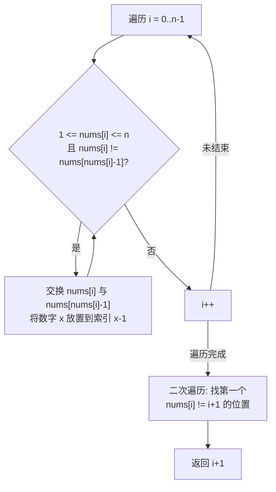

# LeetCode 41. First Missing Positive（缺失的第一个正数）

## 考点
Array, Hash Table

## 题目描述
给你一个未排序的整数数组 `nums`，请你找出其中没有出现的最小的正整数。

请你实现时间复杂度为 O(n) 并且只使用常数级别额外空间的解决方案。

### 示例 1
```
输入：nums = [1,2,0]
输出：3
```

### 示例 2
```
输入：nums = [3,4,-1,1]
输出：2
```

### 示例 3
```
输入：nums = [7,8,9,11,12]
输出：1
```

### 约束
- `1 <= nums.length <= 10^5`
- `-2^31 <= nums[i] <= 2^31 - 1`

## 图解



> **示例 [3,4,-1,1]**: i=0: swap(3, -1) → [-1,4,3,1] → i=0: -1 跳过 → i=1: swap(4, 1) → [-1,1,3,4] → swap(1, -1) → [1,-1,3,4] → i=2: 3正确 → i=3: 4正确 → 二次遍历: i=1 时 nums[1]=-1 ≠ 2 → 返回 2

## 解题思路

### 方法：原地哈希
核心思想：答案一定在 `[1, n+1]` 范围内（n 是数组长度）。将数组视为哈希表，把值 `x`（范围 `[1, n]`）放到索引 `x-1` 的位置。

**步骤：**
1. 遍历数组，将范围在 `[1, n]` 内的值放到对应位置（`nums[i]` 放到 `nums[nums[i]-1]`）。
2. 交换后继续检查当前位置的新值，直到当前位置的值不在 `[1, n]` 范围或已在正确位置。
3. 再次遍历数组，第一个 `nums[i] !== i + 1` 的位置对应的 `i + 1` 就是答案。
4. 如果所有位置都正确，返回 `n + 1`。

**关键点：**
- 负数和大于 n 的数不影响结果，可以忽略。
- 使用 while 循环而非 if，因为交换后需要继续处理新换过来的值。
- O(n) 时间内每个元素最多被交换一次。

时间复杂度：O(n)
空间复杂度：O(1)
