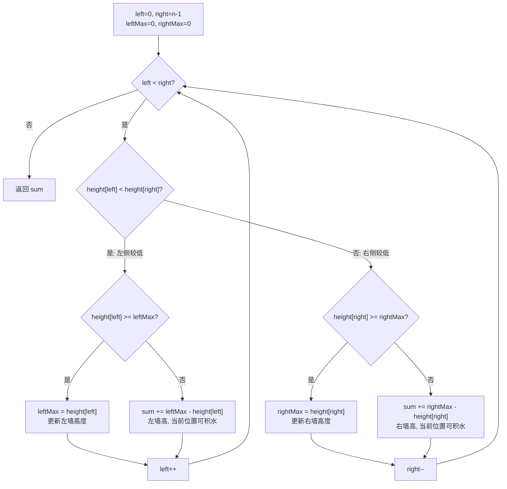

# LeetCode 42. Trapping Rain Water（接雨水）

## 考点
Stack, Array, Two Pointers, Dynamic Programming

## 题目描述
给定 `n` 个非负整数表示每个宽度为 `1` 的柱子的高度图，计算按此排列的柱子，下雨之后能接多少雨水。

### 示例 1
```
输入：height = [0,1,0,2,1,0,1,3,2,1,2,1]
输出：6
```

### 示例 2
```
输入：height = [4,2,0,3,2,5]
输出：9
```

### 约束
- `n == height.length`
- `1 <= n <= 2 * 10^4`
- `0 <= height[i] <= 10^5`

## 图解



> **核心**: 较低的一侧决定了当前水量上限 —— 因为对面有更高的柱子挡着，当前侧的水不会溢出。

## 解题思路

### 方法：双指针
核心思想：每个位置能接的雨水量取决于其左右两侧最高柱子的较小值。用双指针从两端向中间收缩，维护左右两侧的最大高度。

**步骤：**
1. `left = 0`, `right = n - 1`。
2. `leftMax = 0`, `rightMax = 0`（左右两侧已遍历过的最大高度）。
3. 当 `left < right`：
   - 如果 `height[left] < height[right]`：
     - 如果 `height[left] >= leftMax`：更新 `leftMax`。
     - 否则：`result += leftMax - height[left]`。
     - `left++`。
   - 否则：
     - 如果 `height[right] >= rightMax`：更新 `rightMax`。
     - 否则：`result += rightMax - height[right]`。
     - `right--`。
4. 返回 `result`。

**关键点：**
- 为什么 `height[left] < height[right]` 时可以安全处理左边？
  - 因为左边的最大高度不会超过右边当前的高度（右边更高挡着），所以左边位置的水量由 `leftMax` 决定。
- 对称地，右边位置同理。

时间复杂度：O(n)
空间复杂度：O(1)
