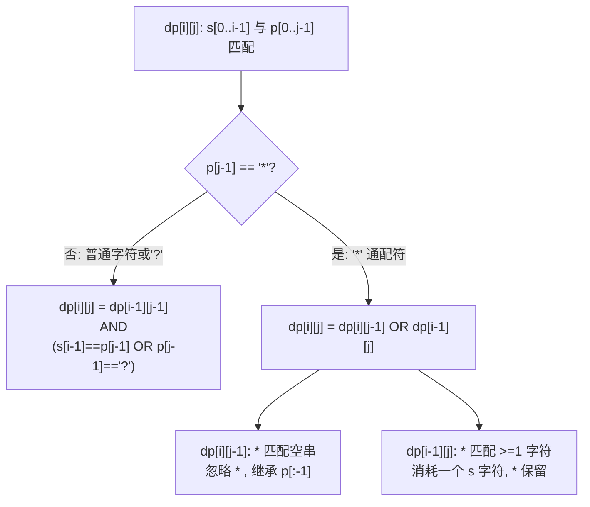

# LeetCode 44. Wildcard Matching（通配符匹配）

## 考点
Greedy, Recursion, String, Dynamic Programming

## 题目描述
给定一个字符串 `s` 和一个字符模式 `p`，实现一个支持 `'?'` 和 `'*'` 的通配符匹配。

- `'?'` 可以匹配任何单个字符。
- `'*'` 可以匹配任意字符串（包括空字符串）。

两个字符串 **完全匹配** 才算匹配成功。

### 示例 1
```
输入：s = "aa", p = "a"
输出：false
```

### 示例 2
```
输入：s = "aa", p = "*"
输出：true
```

### 示例 3
```
输入：s = "cb", p = "?a"
输出：false
```

### 约束
- `0 <= s.length, p.length <= 2000`
- `s` 仅由小写英文字母组成
- `p` 仅由小写英文字母、`'?'` 或 `'*'` 组成

## 图解



> **状态转移**: 初始化 dp[0][0]=true。第一行 dp[0][j]: 如果前 j 个都是 '*' 则为 true。最终返回 dp[m][n]。

## 解题思路

### 方法：动态规划
核心思想：`dp[i][j]` 表示 `s[0..i-1]` 和 `p[0..j-1]` 是否匹配。

**状态转移：**
1. 如果 `p[j-1]` 不是 `'*'`：
   - `dp[i][j] = dp[i-1][j-1] && (s[i-1] === p[j-1] || p[j-1] === '?')`

2. 如果 `p[j-1]` 是 `'*'`：
   - 匹配空串：`dp[i][j] = dp[i][j-1]`
   - 匹配 ≥1 个字符：`dp[i][j] = dp[i-1][j]`
   - 即：`dp[i][j] = dp[i][j-1] || dp[i-1][j]`

**初始化：**
- `dp[0][0] = true`
- `dp[0][j]`：前 j 个字符都是 `'*'` 时可以为 true

**步骤：**
1. 创建 `(m+1) × (n+1)` DP 表。
2. 初始化第一行。
3. 按行填充 DP 表。
4. 返回 `dp[m][n]`。

时间复杂度：O(m × n)
空间复杂度：O(m × n)，可优化至 O(n)
