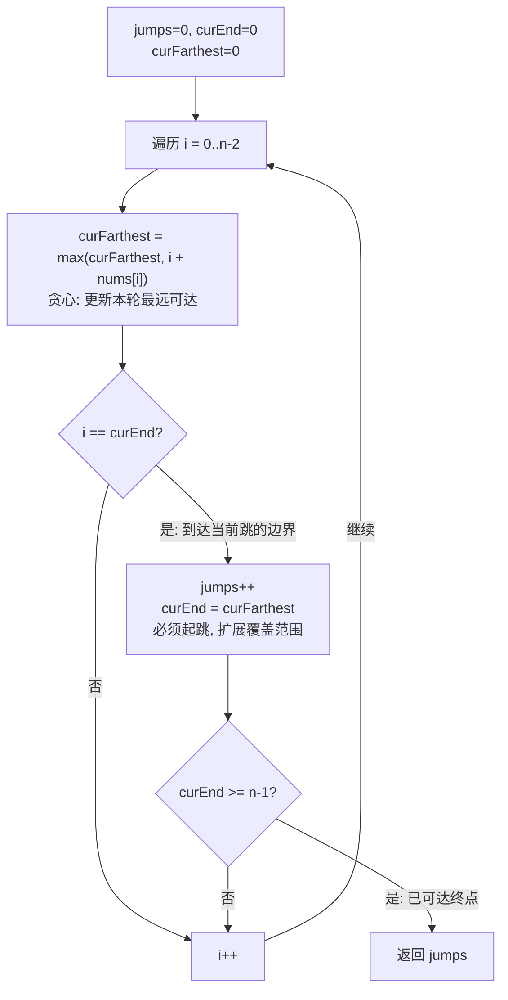

# LeetCode 45. Jump Game II（跳跃游戏 II）

## 考点
Greedy, Array, Dynamic Programming

## 题目描述
给定一个长度为 `n` 的 **0 索引** 整数数组 `nums`。初始位置为 `nums[0]`。

每个元素 `nums[i]` 表示从索引 `i` 向前跳转的最大长度。换句话说，如果你在 `nums[i]` 处，你可以跳转到任意 `nums[i + j]` 处：
- `0 <= j <= nums[i]`
- `i + j < n`

返回到达 `nums[n - 1]` 的 **最小跳跃次数**。生成的测试用例保证可以到达 `nums[n - 1]`。

### 示例 1
```
输入: nums = [2,3,1,1,4]
输出: 2
解释: 跳到最后一个位置的最小跳跃数是 2。从下标 0 到下 1（跳 1 步），然后到达最后一个位置。
```

### 示例 2
```
输入: nums = [2,3,0,1,4]
输出: 2
```

### 约束
- `1 <= nums.length <= 10^4`
- `0 <= nums[i] <= 1000`
- 保证可以到达 `nums[n - 1]`

## 图解



> **示例 [2,3,1,1,4]**: i=0: farthest=2, i==curEnd(0) → jumps=1, curEnd=2 → i=1: farthest=4, i≠curEnd → i=2: farthest=4, i==curEnd(2) → jumps=2, curEnd=4≥4 → 返回2

## 解题思路

### 方法：贪心（BFS 思想）
核心思想：在当前位置可达的范围内，选择能跳得最远的位置，每次跳跃都尽可能扩大下一跳的覆盖范围。

**步骤：**
1. `jumps = 0`（跳跃次数），`curEnd = 0`（当前跳跃可达的最远位置），`curFarthest = 0`（从当前位置能跳到的最远位置）。
2. 遍历数组（不包含最后一个元素，因为不需要从最后一个起跳）：
   - `curFarthest = Math.max(curFarthest, i + nums[i])`。
   - 如果 `i === curEnd`（到达当前跳跃范围的边界）：
     - `jumps++`。
     - `curEnd = curFarthest`。
     - 如果 `curEnd >= n - 1`，返回 `jumps`。
3. 返回 `jumps`。

**关键点：**
- 贪心策略：每次在可达范围内选择能跳到最远的下一个位置。
- 题目保证可达，所以不需要判断无法到达的情况。
- 遍历到 `n - 2` 即可，到达 `n - 1` 时不需要再跳跃。

时间复杂度：O(n)
空间复杂度：O(1)
