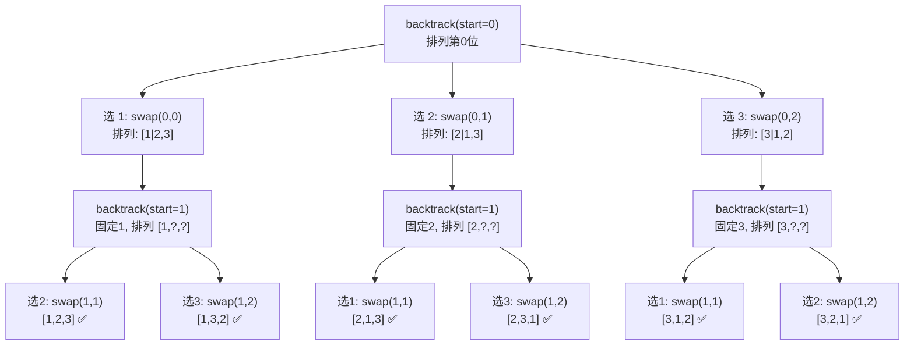

# LeetCode 46. Permutations（全排列）

## 考点
Array, Backtracking

## 题目描述
给定一个不含重复数字的数组 `nums`，返回其所有可能的全排列。你可以按任意顺序返回答案。

### 示例 1
```
输入：nums = [1,2,3]
输出：[[1,2,3],[1,3,2],[2,1,3],[2,3,1],[3,1,2],[3,2,1]]
```

### 示例 2
```
输入：nums = [0,1]
输出：[[0,1],[1,0]]
```

### 约束
- `1 <= nums.length <= 6`
- `-10 <= nums[i] <= 10`
- `nums` 中的所有整数互不相同

## 图解



> **原地交换法**: start 之前的位置已确定排列, start 位置依次与后续元素交换(包括自身), 递归后将交换恢复。

## 解题思路

### 方法：回溯
核心思想：DFS 遍历所有可能的排列路径，使用 `used` 数组（或交换法）标记已使用的元素。

**方法一：used 数组回溯**
1. 创建 `used` 布尔数组标记元素是否已使用。
2. `backtrack(path)`：
   - 如果 `path.length === nums.length`，加入结果。
   - 遍历所有元素，跳过已使用的，加入 `path`，标记 `used`，递归，回溯撤销。

**方法二：原地交换**
1. `backtrack(start)`：
   - 如果 `start === nums.length`，将 `nums` 的副本加入结果。
   - 从 `start` 开始遍历，交换 `nums[start]` 和 `nums[i]`，递归 `backtrack(start+1)`，再交换回来。

**关键点：**
- `used` 数组法：每个位置选择哪个元素。
- 交换法：每个位置固定后，在剩余元素中选择（更节省空间）。
- `n ≤ 6`，全排列数量 n! ≤ 720，完全可行。

时间复杂度：O(n × n!)
空间复杂度：O(n)（递归栈 + used 数组）
