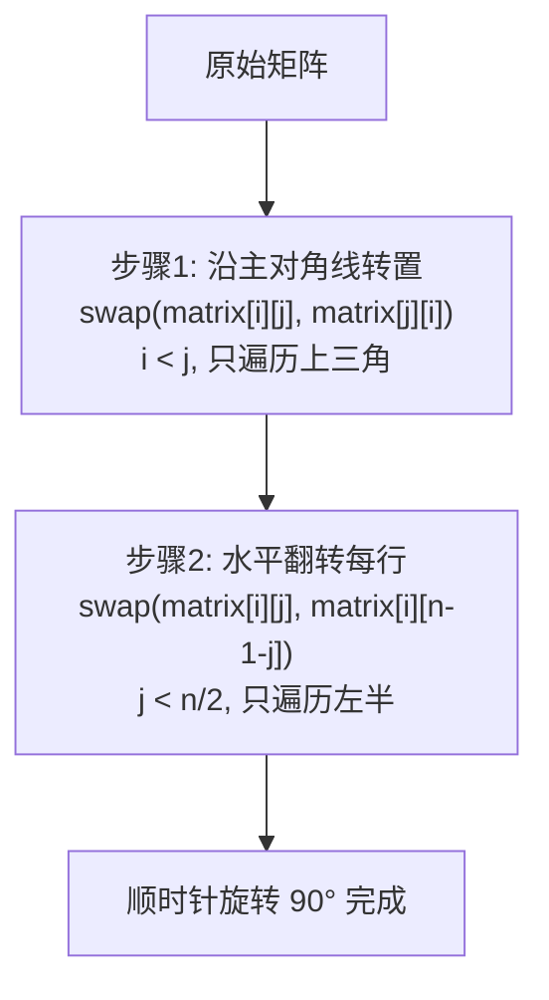
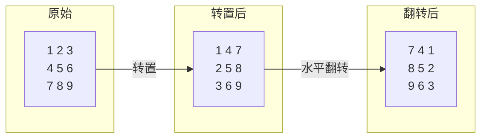

# LeetCode 48. Rotate Image（旋转图像）

## 考点
Array, Math, Matrix

## 题目描述
给定一个 `n × n` 的二维矩阵 `matrix` 表示一个图像。请你将图像顺时针旋转 90 度。

你必须在 **原地** 旋转图像，这意味着你需要直接修改输入的二维矩阵。请不要使用另一个矩阵来旋转图像。

### 示例 1
```
输入：matrix = [[1,2,3],[4,5,6],[7,8,9]]
输出：[[7,4,1],[8,5,2],[9,6,3]]
```

### 示例 2
```
输入：matrix = [[5,1,9,11],[2,4,8,10],[13,3,6,7],[15,14,12,16]]
输出：[[15,13,2,5],[14,3,4,1],[12,6,8,9],[16,7,10,11]]
```

### 约束
- `n == matrix.length == matrix[i].length`
- `1 <= n <= 20`
- `-1000 <= matrix[i][j] <= 1000`

## 图解





> **数学原理**: 顺时针旋转 90° 等价于 `matrix_new[col][n-1-row] = matrix[row][col]`。先转置(行列对调)再水平翻转(列逆序) 正好得到该映射。

## 解题思路

### 方法：原地旋转（转置 + 水平翻转）
核心思想：矩阵顺时针旋转 90° = 先转置（主对角线翻转）+ 再水平翻转（每行反转）。

**步骤：**
1. **转置**：遍历矩阵上三角部分（`i < j`），交换 `matrix[i][j]` 和 `matrix[j][i]`。
2. **水平翻转**：遍历每行，反转该行（交换 `matrix[i][j]` 和 `matrix[i][n-1-j]`）。

**数学原理：**
- 顺时针 90°：`matrix_new[col][n-1-row] = matrix[row][col]`
- 先转置：`matrix[row][col] → matrix[col][row]`
- 再水平翻转：`matrix[col][row] → matrix[col][n-1-row]`
- 结果：`matrix[col][n-1-row]` ✓

**关键点：**
- 转置时只遍历上三角，避免重复交换。
- 水平翻转时只遍历每行的前半部分。
- 两步操作都是原地完成。

时间复杂度：O(n²)
空间复杂度：O(1)
