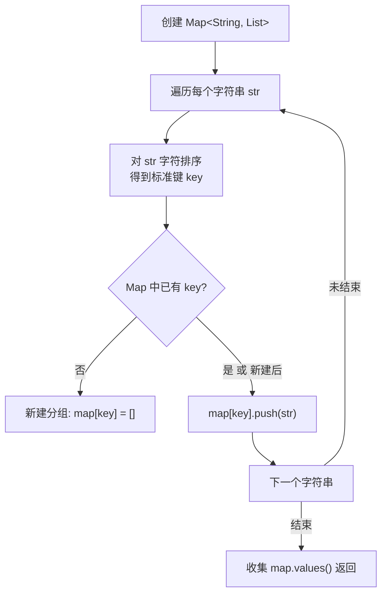

# LeetCode 49. Group Anagrams（字母异位词分组）

## 考点
Array, Hash Table, String, Sorting

## 题目描述
给你一个字符串数组，请你将 **字母异位词** 组合在一起。可以按任意顺序返回结果列表。

**字母异位词** 是通过重新排列源单词的所有字母得到的新单词。所有源单词中的字母通常恰好只用一次。

### 示例 1
```
输入: strs = ["eat","tea","tan","ate","nat","bat"]
输出: [["bat"],["nat","tan"],["ate","eat","tea"]]
```

### 示例 2
```
输入: strs = [""]
输出: [[""]]
```

### 约束
- `1 <= strs.length <= 10^4`
- `0 <= strs[i].length <= 100`
- `strs[i]` 仅包含小写字母

## 图解



> **示例 ["eat","tea","tan","ate","nat","bat"]**: "eat"→"aet"建组["eat"] → "tea"→"aet"加入["eat","tea"] → "tan"→"ant"建组["tan"] → ... 最终分组: {"aet":["eat","tea","ate"], "ant":["tan","nat"], "abt":["bat"]}

## 解题思路

### 方法：哈希表 + 排序
核心思想：互为字母异位词的单词，排序后得到的字符串相同。以此作为哈希表的键进行分组。

**步骤：**
1. 创建哈希表 `Map<string, string[]>`。
2. 遍历每个字符串：
   - 将字符串转为字符数组、排序、再转回字符串，作为键。
   - 将原始字符串追加到对应键的数组中。
3. 将哈希表的所有值（分组列表）收集到结果中并返回。

### 优化：计数编码
因为只有 26 个小写字母，可以用字符计数数组作为键（转为字符串 "#2#1#0#..." 表示 a 出现 2 次、b 出现 1 次等），避免排序的 O(k log k) 开销。

**关键点：**
- 排序法最直观且足够高效。
- 计数法在字符串长度较大时更优，避免了排序。
- 两种方法的空间复杂度都是 O(nk)，其中 n 是单词数，k 是最长单词长度。

时间复杂度：O(n × k log k)（排序法），O(n × k)（计数法）
空间复杂度：O(n × k)
